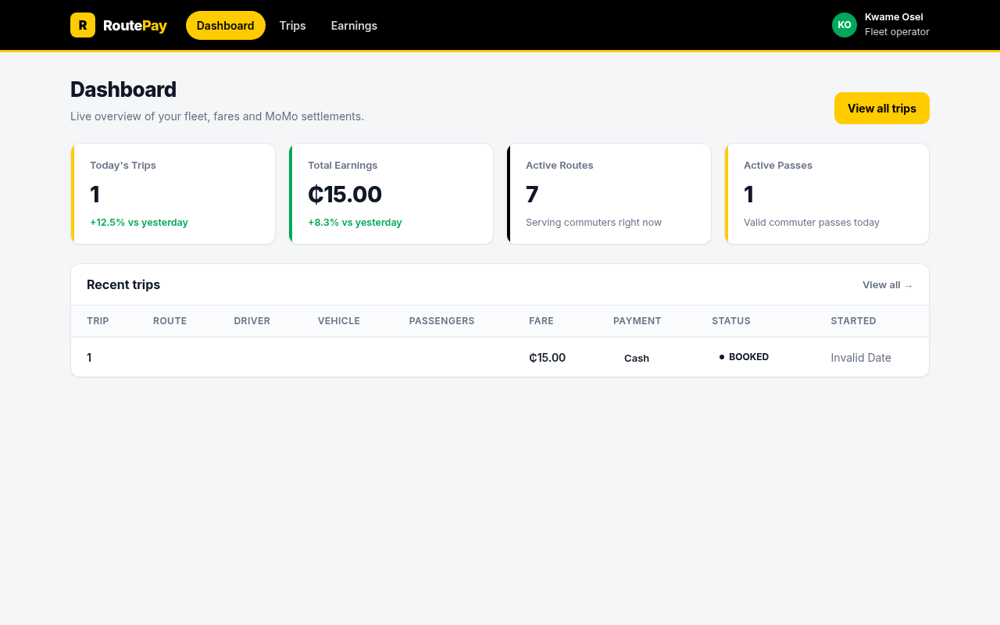
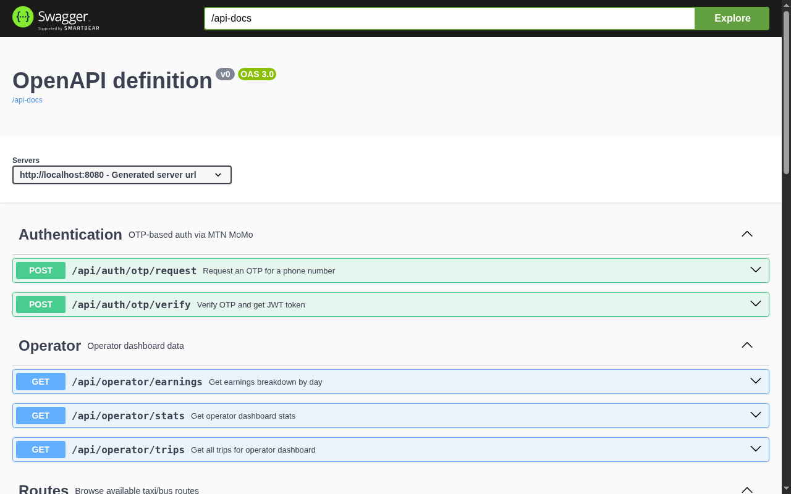
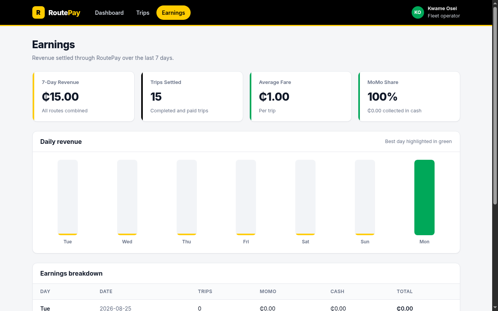

# RoutePay

**Every ride. One tap.**


A MoMo Mini App that lets South African taxi commuters pay fares via MoMo in
under 5 seconds, plan multi-modal routes, and buy travel passes — while
operators get instant payouts and a real-time earnings dashboard.

Built for the **MoMo Mini App Hackathon 2026** (Track 3: Travel and Mobility).

## Table of Contents

- [Demo](#demo)
- [Screenshots](#screenshots)
- [🎥 Demo Video](#-demo-video)
- [Why RoutePay Wins](#-why-routepay-wins)
- [Path to Production](#-path-to-production)
- [Quick Start](#quick-start)
- [Architecture](#architecture)
- [MoMo API Integration](#momo-api-integration)
- [Tech Stack](#tech-stack)
- [API Endpoints](#api-endpoints)
- [Testing](#testing)
- [Documentation](#documentation)
- [Team](#-team)
- [Acknowledgments](#-acknowledgments)
- [License](#license)

---

## Screenshots

| Screenshot | Description |
|------------|-------------|
|  | Live fleet stats, revenue charts, MoMo API status |
|  | All five MoMo API endpoints documented and testable |
|  | 7-day revenue breakdown and trip settlement |
|  | Marketing page with problem/solution/CTA |
| Mobile App *(from Expo Go)* | OTP login, route browsing, QR scan payment *(add before demo)* |

---

## 🎥 Demo Video

*Demo video will be recorded before the hackathon. Shows the full flow: OTP login → route browse → trip booking → travel pass → operator dashboard update.*

> Pre-recorded backup demo keeps the pitch on track even if the live demo fails.

---

## 🏆 Why RoutePay Wins

1. **Real Problem** — 15M+ daily taxi commuters, 90% pay cash, no digital history
2. **All 5 MoMo APIs** — Collections, Disbursements, Remittances, Payments, Auth
3. **Two-Sided Value** — Commuters get speed/safety, operators get creditworthiness
4. **Path to Production** — Mock → live is one config change
5. **Production-Grade** — 71 tests, security audited, Docker-ready, CI-enabled
6. **Super App Aligned** — Becomes the mobility layer of the future MoMo Super App

---

## 🚀 Path to Production

RoutePay is designed to go from hackathon demo to production in 3 steps:

### Step 1: Get MoMo Credentials
- Sign up at <https://momodeveloper.mtn.com/>
- Get subscription key, API user, API key
- Update `.env`:
  ```bash
  MOMO_ENVIRONMENT=SANDBOX    # or PRODUCTION
  MOMO_SUBSCRIPTION_KEY=<your-key>
  ```

### Step 2: Switch Database to PostgreSQL
- Provision PostgreSQL (Supabase, AWS RDS, etc.)
- Update `.env`:
  ```bash
  DB_HOST=<your-host>
  DB_NAME=routepay
  DB_USER=<your-user>
  DB_PASSWORD=<your-password>
  ```
- Run migrations: `mvn flyway:migrate`

### Step 3: Deploy
- Backend: Railway, Heroku, AWS, or DigitalOcean
- Frontend: Vercel or Netlify
- Mobile: Expo EAS Build → App Store / Play Store

**That's it.** Same code, same tests, same security. Just swap the env vars.

---

## Demo

```bash
bash scripts/demo.sh
```

This builds the backend, starts it on port **8080**, waits for it to be
healthy, and prints the full demo flow with curl commands. Press `Ctrl+C` to
stop. See [scripts/demo.md](scripts/demo.md) for the step-by-step judge guide.

> **All MoMo API calls are mocked by default** (`momo.environment=MOCK`).
> Every payment returns `SUCCESSFUL` instantly — no real money moves.

## Quick Start

### Backend

```bash
# Build everything
mvn clean install

# Run the API server
mvn spring-boot:run -pl services/api

# Swagger UI
open http://localhost:8080/swagger-ui.html
```

### Operator Dashboard

```bash
cd apps/operator-dashboard
npm install
npm run dev          # http://localhost:3000
```

### Mini App (React Native)

```bash
cd apps/miniapp
npm install
npx expo start       # scan QR with Expo Go
```

### Landing Page

```bash
cd apps/landing
npm install
npm run dev          # http://localhost:3001
```

### Docker Compose (full stack)

```bash
docker compose up --build
```

| Service  | URL                          |
| -------- | ---------------------------- |
| API      | http://localhost:8080         |
| Swagger  | http://localhost:8080/swagger-ui.html |
| Dashboard| http://localhost:3000         |
| Landing  | http://localhost:3001         |
| PostgreSQL| localhost:5432               |

---

## Architecture

```
RoutePay/
├── apps/
│   ├── miniapp/              # React Native (Expo) — MoMo Mini App
│   ├── operator-dashboard/   # Next.js 14 — Operator web dashboard
│   └── landing/              # Next.js — Marketing page
├── services/
│   └── api/                  # Java 17 + Spring Boot 3.2
├── packages/
│   ├── momo-sdk/             # Reusable Java MoMo API client
│   └── ...                   # (reserved for future shared packages)
├── scripts/
│   ├── demo.sh               # One-command demo launcher
│   └── demo.md               # Step-by-step demo guide
├── docs/                     # Architecture decisions, wireframes
└── docker-compose.yml        # Full local dev stack
```

## MoMo API Integration

All five MoMo API groups are integrated via the reusable `momo-sdk` library:

| API | Purpose | Endpoint | Status |
|-----|---------|----------|--------|
| Authentication | OTP login | `/api/auth/otp/*` | Mock |
| Collections | Fare payments | `/api/trips` | Mock |
| Payments | Travel passes | `/api/passes` | Mock |
| Disbursements | Operator payouts | SDK ready | Mock |
| Remittances | Cross-border corridors | SDK ready | Mock |

The SDK supports three environments via config:

```yaml
momo:
  environment: MOCK        # MOCK | SANDBOX | PRODUCTION
```

- **MOCK** — Fake responses with realistic UUIDs and timestamps (default)
- **SANDBOX** — MTN MoMo sandbox API
- **PRODUCTION** — Live MTN MoMo API

## Tech Stack

| Layer | Technology |
|-------|-----------|
| Backend | Java 17, Spring Boot 3.2.5, Maven |
| Database | H2 (dev), PostgreSQL 16 (prod) |
| ORM | Spring Data JPA + Flyway migrations |
| Auth | Spring Security + JWT + phone OTP |
| Real-time | Spring WebSocket + STOMP |
| MoMo SDK | Custom Java HTTP client (5 API groups) |
| Mini App | React Native (Expo SDK 50), TypeScript |
| Dashboard | Next.js 14, TypeScript |
| Landing | Next.js 14, TypeScript |
| API Docs | springdoc-openapi (Swagger UI) |
| Testing | JUnit 5 + Mockito + AssertJ (71 tests) |

## API Endpoints

### Authentication

| Method | Endpoint | Description |
|--------|----------|-------------|
| POST | `/api/auth/otp/request` | Request OTP for phone number |
| POST | `/api/auth/otp/verify` | Verify OTP, returns JWT |

### Routes

| Method | Endpoint | Description |
|--------|----------|-------------|
| GET | `/api/routes` | List all routes |
| GET | `/api/routes/{id}` | Get route details |

### Trips

| Method | Endpoint | Description |
|--------|----------|-------------|
| POST | `/api/trips` | Book a trip (requires auth) |
| GET | `/api/trips` | List user's trips (requires auth) |

### Travel Passes

| Method | Endpoint | Description |
|--------|----------|-------------|
| POST | `/api/passes` | Purchase a pass (requires auth) |
| GET | `/api/passes` | List user's passes (requires auth) |

### Infrastructure

| Method | Endpoint | Description |
|--------|----------|-------------|
| GET | `/actuator/health` | Health check |
| GET | `/swagger-ui.html` | API documentation |
| WS | `/ws` | WebSocket (STOMP/SockJS) |
| SUB | `/topic/trips` | Trip update broadcasts |

## Seeded Data

7 Johannesburg taxi routes are pre-seeded via Flyway:

| ID | Route | Fare |
|----|-------|------|
| 1 | Joburg CBD → Soweto | R15.00 |
| 2 | Sandton → Midrand | R22.00 |
| 3 | Braamfontein → Rosebank | R12.00 |
| 4 | Tembisa → Pretoria CBD | R35.00 |
| 5 | Alexandra → Sandton | R10.00 |
| 6 | Randburg → Roodepoort | R20.00 |
| 7 | Vereeniging → Johannesburg CBD | R45.00 |

## Project Structure

### Backend (`services/api`)

- **Entities**: User, Route, Stop, Trip, TravelPass, Payment, Operator
- **Controllers**: AuthController, RouteController, TripController, TravelPassController
- **Services**: AuthService, RouteService, TripService, TravelPassService
- **Security**: JWT token provider, stateless session, OTP-based auth
- **WebSocket**: STOMP broker at `/ws`, broadcasts to `/topic/trips`

### MoMo SDK (`packages/momo-sdk`)

Reusable Java library wrapping all MoMo API groups:

- `MoMoClient` — Main entry point (builder pattern)
- `AuthClient` — OTP request/verify + token generation
- `CollectionsClient` — Fare collection (requestToPay)
- `PaymentsClient` — Pass purchases
- `DisbursementsClient` — Operator payouts
- `RemittancesClient` — Cross-border transfers
- `MockMoMoBackend` — Fake responses for demo/testing

### Mini App (`apps/miniapp`)

- **Auth**: Phone number + OTP login (SA format +27)
- **Routes**: Browse available taxi routes, view fares
- **Trips**: Book trips, view trip history with status
- **Passes**: Purchase daily (R25), weekly (R99), or monthly (R350) passes
- **Profile**: User info, logout
- **Branding**: `#FFCC00` yellow, `#000000` black, `#00A859` green

### Operator Dashboard (`apps/operator-dashboard`)

- **Stats**: Today's trips, total earnings, active routes, active passes
- **Trips**: Monitor all trips with status filtering
- **Earnings**: Daily/weekly/monthly revenue breakdown

### Operator Dashboard

| Method | Endpoint | Description |
|--------|----------|-------------|
| GET | `/api/operator/stats` | Fleet stats (public for demo) |
| GET | `/api/operator/trips` | All trips (requires auth) |
| GET | `/api/operator/earnings` | Earnings breakdown (requires auth) |

## Environment Variables

Copy `.env.example` to `.env` and fill in your values:

```bash
cp .env.example .env
```

Key variables:

| Variable | Default | Description |
|----------|---------|-------------|
| `JWT_SECRET` | (change me) | JWT signing secret |
| `MOMO_ENVIRONMENT` | `MOCK` | MoMo API environment |
| `MOMO_SUBSCRIPTION_KEY` | `mock-subscription-key` | MoMo subscription key |
| `DB_HOST` | `localhost` | PostgreSQL host |
| `DB_NAME` | `routepay` | PostgreSQL database |
| `EXPO_PUBLIC_API_URL` | `http://localhost:8080` | API URL for mini app |
| `NEXT_PUBLIC_API_URL` | `http://localhost:8080` | API URL for dashboard |

## Testing

```bash
# Run all tests (71 tests)
mvn test

# Run specific module tests
mvn test -pl packages/momo-sdk    # 47 SDK tests
mvn test -pl services/api         # 24 API tests

# Build without tests
mvn clean install -DskipTests
```

## Design Decisions

See [docs/DECISIONS.md](docs/DECISIONS.md) for architecture rationale.
See [docs/API.md](docs/API.md) for MoMo API integration details.
See [docs/DEMO_SCRIPT.md](docs/DEMO_SCRIPT.md) for the 3-minute judge walkthrough.
See [docs/PITCH.md](docs/PITCH.md) for the pitch narrative.
See [docs/JUDGE_QA.md](docs/JUDGE_QA.md) for anticipated judge questions.

Key decisions:
- **Mock-first**: SDK defaults to mock mode for reliable hackathon demos
- **H2 for dev**: Zero-setup database, Flyway ensures schema parity with PostgreSQL
- **JWT auth**: Stateless tokens, standard for mobile apps
- **WebSocket + STOMP**: Real-time trip updates without external dependencies
- **Multi-module Maven**: SDK is reusable, API is independently deployable

## Documentation

Comprehensive documentation lives in the [docs/](docs/) folder:

| Document | Purpose |
|----------|---------|
| [docs/README.md](docs/README.md) | Master documentation index |
| [docs/DEMO_SCRIPT.md](docs/DEMO_SCRIPT.md) | 3-minute judge walkthrough |
| [docs/PITCH.md](docs/PITCH.md) | Pitch narrative |
| [docs/JUDGE_QA.md](docs/JUDGE_QA.md) | Anticipated judge questions |
| [docs/API.md](docs/API.md) | MoMo API integration guide |
| [docs/DECISIONS.md](docs/DECISIONS.md) | Architecture decisions |
| [docs/QA_AUDIT.md](docs/QA_AUDIT.md) | Security audit results |
| [docs/PRE_DEMO_CHECKLIST.md](docs/PRE_DEMO_CHECKLIST.md) | Pre-demo preparation |
| [docs/FINAL_AUDIT.md](docs/FINAL_AUDIT.md) | Final status report |

## 👤 Team

Built by **Aphile Ngubeni** ([@DemainMan](https://github.com/DemainMan)) for the MoMo Mini App Hackathon 2026.

- **Role:** Solo developer
- **Location:** Johannesburg, South Africa
- **Track:** Travel and Mobility
- **Stack:** Java 17, Spring Boot 3.2, Next.js 14, Expo, PostgreSQL

## 🙏 Acknowledgments

- **MTN MoMo** — For the opportunity and the MoMo APIs
- **Spring Boot** — For the robust backend framework
- **Next.js** — For the beautiful dashboard
- **Expo** — For the mobile app platform
- **The open-source community** — For countless libraries that made this possible

## License

MIT
